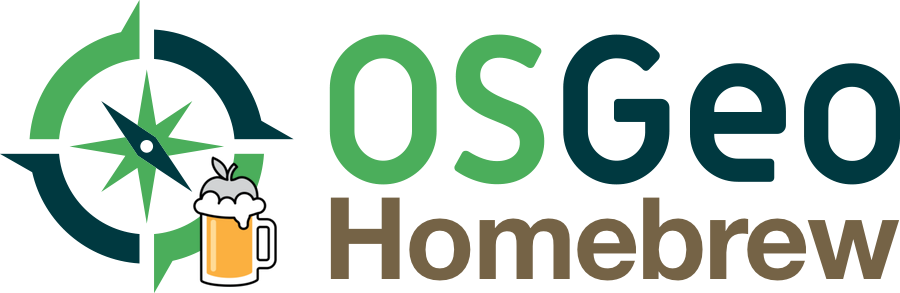

# Homebrew-osgeo4mac

**Build Status**: [](https://circleci.com/gh/OSGeo/homebrew-osgeo4mac)

This is the [homebrew's][homebrew] tap for the **stable** versions of the [OSGeo][osgeo] geospatial toolset. Right now our main focus is to provide and up-to-date [QGIS][qgis] formulae easy to install to the end user. The tap includes formulae that may not be specifically
from an OSGeo project, but do extend the toolset's functionality

## How do I install these formulae?

Just `brew tap osgeo/osgeo4mac` and then `brew install <formula>`. Easy, isn't it? 

You can also install via URL:

```shell
$ brew install https://raw.githubusercontent.com/OSGeo/homebrew-osgeo4mac/master/Formula/<formula>.rb
```

## Docs

Run `brew help`, `man brew`, check the [Homebrew documentation][] or the [tap documentation][osgeo4mac-docs].


[homebrew]:http://brew.sh
[taps]:https://github.com/Homebrew/homebrew-versions
[documentation]:https://github.com/Homebrew/brew/tree/master/docs#readme
[osgeo]: https://www.osgeo.org
[qgis]: https://www.qgis.org
[homebrew-core]: https://github.com/Homebrew/homebrew-core
[taps-docs]: https://docs.brew.sh/Taps
[osgeo4mac-docs]: https://osgeo.github.io/homebrew-osgeo4mac/
